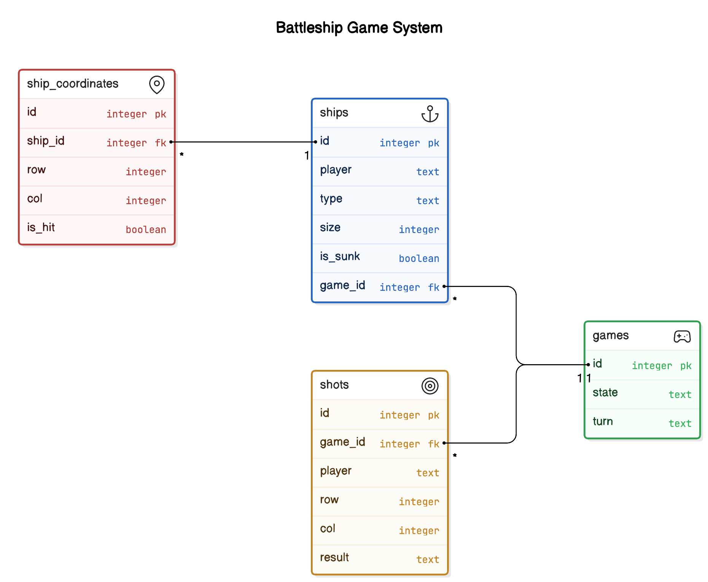
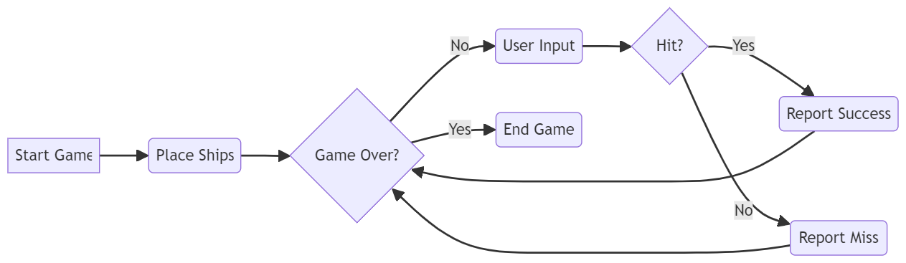

# Battleship Game

## Overview
This project is a simple one-sided Battleship game where a single human player plays against the computer. The objective is to sink the computer's ships before it sinks yours. The game is played on a 10x10 grid, with ships randomly placed by both the player and the computer.

## Features
- **Random Ship Placement:** Ships (1 Battleship and 2 Destroyers) are placed randomly on the 10x10 grid.
- **Human vs Computer:** The player selects squares to target, and the computer automatically plays its turn.
- **Shot Feedback:** After each shot, feedback is given on whether it was a hit or a miss.
- **Ship Sinking:** The game reports when a ship has been sunk.
- **Game End:** The game finishes when all ships of either the player or the computer have been sunk.

## ER Diagram


## System flow diagram


## Prerequisites
To run this application, you need to have the following installed:
- [Node.js](https://nodejs.org/) (v14.x or higher)
- [npm](https://www.npmjs.com/) (comes with Node.js)

## Installation
1. Clone the repository:
    ```bash
    git clone https://github.com/Pirathikaran/battleship.git
    ```
2. Navigate to the project directory:
    ```bash
    cd battleship
    ```
3. Install the required dependencies:
    ```bash
    npm install
    ```

## Usage
1. Start the server:
    ```bash
    npm start
    ```
2. The API will be running on `http://localhost:3000`. You can use Postman or any other tool to interact with the game.

## API Endpoints

### Start a New Game
- **Endpoint:** `POST /api/games/start`
- **Description:** Starts a new game, randomly placing ships for both the player and the computer.
- **Response:**
    ```json
    {
      "gameId": 1
    }
    ```

### Take a Shot
- **Endpoint:** `POST /api/games/:gameId/shot`
- **Example:** `POST /api/games/1/shot`
- **Description:** The player selects a square to target, and the computer automatically takes a shot.
- **Request Body:**
    ```json
    {
      "player": "player",
      "row": 5,
      "col": 3
    }
    ```
- **Response:**
    ```json
    {
    "playerResult": {
        "result": {
            "hit": true,
            "message": "Hit!",
            "shipSunk": false
        },
        "col": 1,
        "row": 5
    },
    "computerResult": {
        "result": {
            "hit": false,
            "message": "Miss"
        },
        "col": 2,
        "raw": 2
    }
}
    ```

### Get Game State
- **Endpoint:** `GET /api/games/:gameId/state`
- **Description:** Retrieves the current state of the game.
- **Response:**
    ```json
    {
      "game": {
        "id": 1,
        "state": "ongoing",
        "turn": "player"
      },
      "playerShips": [
        {
          "type": "battleship",
          "size": 5,
          "is_sunk": 0
        },
        ...
      ],
      "computerShips": [
        {
          "type": "destroyer",
          "size": 4,
          "is_sunk": 0
        },
        ...
      ]
    }
    ```

## Game Logic
- **Grid:** The game board is a 10x10 grid, and both the player and the computer take turns selecting coordinates on the grid to fire shots.
- **Ships:** There is one Battleship (5 squares) and two Destroyers (4 squares each) for both the player and the computer.
- **Turn-Based:** Each player gets one shot per turn. After the human player fires, the computer automatically takes its shot.

## Technologies Used
- **Backend:**
  - Node.js
  - Express.js
- **Database:**
  - SQLite for storing game states, ships, and shots
- **Other:**
  - JavaScript for backend logic
